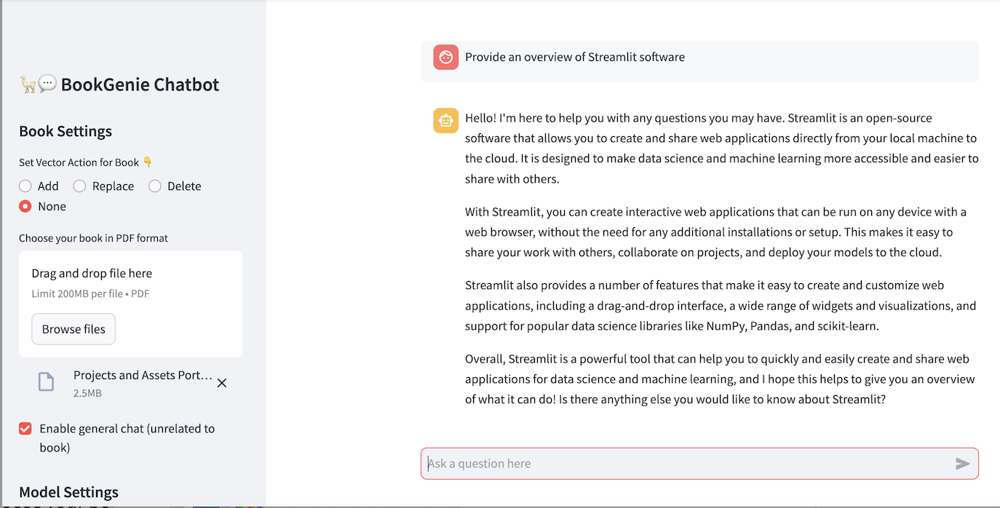

# 🦙📚 BookGenie Chatbot with Streamlit

## Table of Contents
* [Overview](#overview)
* [App Description](#app-description)
* [Technologies Used](#technologies-used)
* [LLM Models Used](#llm-models-used)
* [How to Use](#how-to-use)
* [Conclusion](#conclusion)
* [Acknowledgements](#acknowledgements)

---

## Overview

BookGenie Chatbot is a Streamlit-based application designed to process books in PDF format and enable meaningful conversations using advanced language models. This project integrates **Streamlit**, **LangChain**, and **Pinecone** to create a sophisticated chatbot experience for users. Here's a quick overview of the tools used:

- **Streamlit**: A Python-based framework to build interactive and user-friendly web apps for machine learning and data science.
- **LangChain**: A framework to build applications powered by language models. LangChain helps with text splitting, embeddings, and chaining large language models for question-answering.
- **Pinecone**: A vector database that enables fast similarity search for text embeddings.

The application also uses **Replicate** to access cutting-edge Llama 2 models and provides seamless integration with powerful language models like **google/flan-t5-large**.

---

## App Description

The BookGenie Chatbot application provides the following functionalities:

1. **PDF Book Processing**: Users can upload a book in PDF format. The text is extracted, split into chunks, and stored as embeddings in the Pinecone vector database.
2. **Vector Actions**:
   - **Add**: Add embeddings for a new book.
   - **Replace**: Replace existing embeddings for previously uploaded books.
   - **Delete**: Remove all existing embeddings.
   - **None**: Use existing embeddings without modifying them.
3. **Book-Related Chat**: Users can ask questions about the uploaded book, and the app will provide accurate answers using the **google/flan-t5-large** language model.
4. **General Chat**: A checkbox enables general conversation unrelated to the uploaded book, powered by **Llama 2 models** hosted on Replicate.
5. **Model Settings**: The user can configure the Llama 2 model parameters, including temperature, top-p, and maximum length, for a customized chat experience.
6. **Chat History**: The app stores the chat history, which can be cleared via a button in the sidebar.

**Chatbot Snapshot:**

---

## Technologies Used

Key technologies and libraries used in this project include:

- **Streamlit**: For building the interactive web application.
- **LangChain**: For text processing, embeddings, and chaining language models.
  - `RecursiveCharacterTextSplitter` for splitting book content into chunks.
  - `HuggingFaceEmbeddings` for generating vector embeddings.
  - `load_qa_chain` for creating a question-answering chain.
- **Pinecone**: As a vector database for storing and searching text embeddings. The index for this project is pre-created as `bookgenie` in Pinecone database.
- **Replicate**: For accessing state-of-the-art Llama 2 models.
- **PyPDF2**: For extracting text from PDF files.

---

## LLM Models Used

The following language models were used in this project:

1. **Llama 2 (via Replicate)**:
   - Llama 2 is a series of large language models with parameters ranging from 7B to 70B. These models are optimized for conversational AI and provide state-of-the-art performance.
   - The app allows users to select one of the following models:
     - Llama 2 7B
     - Llama 2 13B
     - Llama 2 70B
   - These models are used for general chat functionality when unrelated to the uploaded book.

2. **google/flan-t5-large (via HuggingFaceHub)**:
   - FLAN-T5 is a fine-tuned version of the T5 model, optimized for answering questions and understanding user queries.
   - It is used to answer book-related questions by leveraging the embeddings stored in Pinecone.

---

## How to Use

1. **Upload a PDF File**: Use the sidebar to upload a PDF book.
2. **Configure Vector Actions**:
   - Select an action (Add, Replace, Delete, or None) for the vector database.
3. **Enable General Chat (Optional)**: Check the box to enable chatting unrelated to the book.
4. **Set Model Parameters**: Customize Llama 2 model settings, including temperature and top-p.
5. **Start Chatting**:
   - Ask questions about the uploaded book or start a general conversation.
   - The chat responses will be displayed in the app.

---

## Conclusion

The BookGenie Chatbot demonstrates the seamless integration of modern NLP tools and frameworks to create a sophisticated and interactive chatbot experience. By leveraging Llama 2 and FLAN-T5 models, users can enjoy both book-specific and general conversations. The use of Pinecone for vector storage ensures fast and efficient retrieval of embeddings, making this app a powerful tool for exploring book content and engaging in meaningful conversations.

---

## Acknowledgements

This project is based on an online training developed by Muhammad Moin, which is as follows:

**Learn LangChain: Build #22 LLM Apps using OpenAI & Llama 2** (https://www.udemy.com/course/learn-langchain-build-12-llm-apps-using-openai-llama-2/)

---